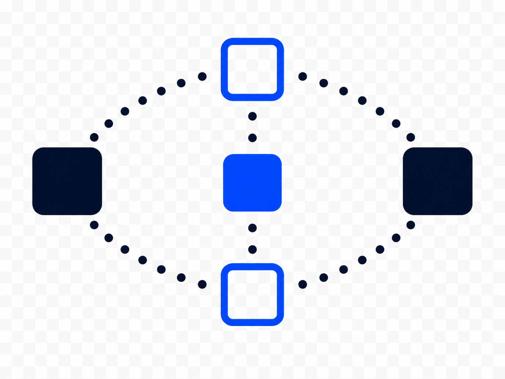

<h1 align="center">
  Seer Core
  
</h1>

Give your AI agents a map of your repo before they edit.

Seer helps agents find code, follow context, and understand what they are changing.

Callers, tests, routes, service links, and git history, all in one local map for your coding agent.

  
  
  
  
  
  

[pimage]

Validated on real agent workflows.*

[benchmark summary block]

*See [Benchmarks](docs/benchmarks.md)

---

## Quick Start

[very short install]

[very short MCP setup]

[first successful command]

→ [Full Quick Start](docs/quickstart.md)

---

## Docs

- [Quick Start](docs/quickstart.md)
- [MCP Setup](docs/mcp.md)
- [Tool Guide](docs/tools.md)
- [CLI Reference](docs/cli.md)
- [Examples](docs/examples.md)
- [Benchmarks](docs/benchmarks.md)
- [Architecture](docs/architecture.md)
- [Known Limits](docs/limits.md)

---

## Why Seer Exists

[problem framing]

[pimage]

---

## What Agents Can Ask Seer

### Before editing unfamiliar code

[pimage]

→ [Example Workflow](docs/examples/pre-edit-context.md)

### Find connected tests

[pimage]

→ [Behavior / Test Examples](docs/examples/behavior-tests.md)

### Follow routes and service boundaries

[pimage]

→ [Service Links Guide](docs/examples/service-links.md)

### Understand recent changes

[pimage]

→ [History / Change Context Examples](docs/examples/change-history.md)

---

## Benchmarks

[pimage]

[small summary table]

→ [Benchmark Summary](docs/benchmarks.md)

→ [Methodology](docs/benchmarks/methodology.md)

→ [Raw Results](docs/benchmarks/raw-results.md)

---

## FAQ

### Is Seer another codebase graph MCP?

### How is Seer different from codebase-memory?

### How is Seer different from Serena?

### Does Seer replace Claude / Cursor / Codex?

### How is Seer different from grep?

→ [Expanded FAQ / Positioning Notes](docs/faq.md)

---

## Installation

### npm

### from source

### MCP configuration

### CI bundles / prebuilt bundles

→ [Full Installation Guide](docs/quickstart.md)

→ [MCP Configuration](docs/mcp.md)

---

## CLI + MCP Reference

### Core CLI commands

### MCP tools overview

### Common workflows

→ [CLI Reference](docs/cli.md)

→ [Tool Reference](docs/tools.md)

---

## Internals

[pimage]

### Indexing

### Symbol layers

### Service links

### Change context

### Storage / bundles

→ [Architecture](docs/architecture.md)

→ [Implementation Notes](docs/internals.md)

---

## Testing + Validation

### Unit / integration / scale testing

### MCP parity testing

### Benchmark validation

→ [Testing Guide](docs/testing.md)

→ [Benchmarks](docs/benchmarks.md)

---

## Supported Languages

→ [Language Support Matrix](docs/languages.md)

---

## Known Limits

→ [Known Limits](docs/limits.md)

---

## Contributing

→ [CONTRIBUTING.md]

---

## License

This project is licensed under the Apache License, Version 2.0. See the [LICENSE](LICENSE) file for the full license text.

