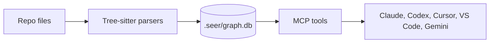

<div align="center">

# Seer

**Give AI coding agents a repo map before they edit.**

[](https://www.npmjs.com/package/seer-mcp)
[](#license)
[](docs/mcp.md)
[](https://nodejs.org/)
[](https://github.com/vladimirhegai/Seer-MCP/actions)

[Quick Start](docs/quickstart.md) |
[Tool Guide](docs/tools.md) |
[Benchmarks](docs/benchmarks.md) |
[Testing](docs/testing.md)

[Insert hero GIF: Codex or Claude asks Seer for pre-edit context on a real function, receives callers, tests, route exposure, history, and risk, then edits with that context visible.]

</div>

## The Missing Layer For Agentic Coding

AI coding agents can write a patch fast. The fragile part is knowing what that
patch is about to touch.

Seer is a **local MCP server** that indexes your repository into a small SQLite
graph and gives agents structural tools they can call while coding:

| An agent asks | Seer returns |
|---|---|
| "What is this symbol?" | Definition, file, line range, qualified name. |
| "Who calls it?" | Direct callers, call sites, snippets, transitive traces. |
| "Which tests matter?" | Tests ranked by how directly they exercise the symbol. |
| "Is this on a route?" | HTTP, RPC, GraphQL, gRPC, and queue links. |
| "What else changes with it?" | Symbol history and co-change evidence. |
| "Can I edit this safely?" | A preflight packet with blast radius and risk signals. |

For vibe coding, this is the map your agent should check before it starts
changing files. For agent-heavy development, it is a reusable context layer
across Claude Code, Codex, Cursor, VS Code, Gemini, Antigravity, and Windsurf.

## Install

The wizard detects your agent, writes the right MCP config, and can build the
first index immediately.

Run this inside the repo you want Seer to understand:

```bash
npx seer-mcp init
```

Requires **Node.js 24+** on Windows, macOS, or Linux.

Optionally, if you already know which client you want, skip the wizard and name
it directly:

```bash
npx seer-mcp init --client claude        # Claude Code, Claude CLI
npx seer-mcp init --client codex         # OpenAI Codex CLI / extension
npx seer-mcp init --client cursor        # Cursor
npx seer-mcp init --client vscode        # VS Code MCP / Copilot, can include agent extensions
npx seer-mcp init --client gemini        # Gemini CLI
npx seer-mcp init --client antigravity   # Antigravity IDE / CLI, can include Claude and Codex extensions
npx seer-mcp init --client windsurf      # Windsurf
npx seer-mcp init --client claude,codex  # Multiple agents in the same repo
npx seer-mcp init --client all           # Every supported client
```

Reload your agent, then ask it to call:

```text
seer_health
```

The reported workspace should be the repo you installed from.

### Indexing

If the wizard builds the index, you are done. You can also build or refresh it
yourself:

```bash
npx seer-mcp index .
npx seer-mcp index . --reset
```

Seer stores the local index at:

```text
<repo>/.seer/graph.db
```

Add `.seer/` to `.gitignore`.

### Git History

Symbol history is optional. You usually do **not** need to build the full
history index before asking for history on one symbol: `seer_history` can build
just the queried symbol's file on a cold miss.

Build the full history index when you want repo-wide co-change signals such as
`seer_changes_with`:

```bash
npx seer-mcp symbol-history
npx seer-mcp symbol-history --since 1y
```

This can take a while on large repos. Re-running it is incremental, and after a
full history index exists, `npx seer-mcp index .` refreshes changed history rows
as part of normal indexing.

## What It Looks Like In Use

Imagine asking your agent:

```text
Before editing chargeCard, use Seer to inspect the callers, tests, route exposure, and risk.
```

The agent can call:

```json
{
  "symbol": "chargeCard"
}
```

through `seer_preflight` and receive a compact packet:

```json
{
  "symbol": {
    "qualifiedName": "billing.PaymentService.chargeCard",
    "file": "src/billing/payment.ts",
    "lineStart": 142
  },
  "callers": [
    { "name": "checkout", "file": "src/api/checkout.ts", "line": 88 },
    { "name": "retryFailedPayment", "file": "src/jobs/retry.ts", "line": 31 }
  ],
  "transitiveDependents": 9,
  "routeExposure": [
    { "method": "POST", "path": "/api/checkout" }
  ],
  "tests": [
    { "name": "charges a valid card", "file": "test/payment.spec.ts" }
  ],
  "risk": {
    "verdict": "high",
    "reasons": [
      "public route POST /api/checkout",
      "9 transitive dependents",
      "cyclomatic 14"
    ]
  }
}
```

## Why Agents Like It

| Agent pain | Seer tool |
|---|---|
| Common names like `init`, `update`, and `render` are ambiguous. | `seer_search`, `seer_context` with `file` |
| Reading a 2,000-line file burns context. | `seer_skeleton` |
| Callers are spread across the repo. | `seer_callers`, `seer_trace` |
| Tests are hard to find from filenames alone. | `seer_behavior` |
| Microservice calls hide the real handler. | `seer_service_links` |
| A diff touches more than it appears to. | `seer_preflight` with `fromRef` / `toRef` |
| Recent history matters. | `seer_history`, `seer_changes_with` |
| Several small facts are needed together. | `seer_batch` |

## Core Workflows

### Pre-Edit Context

```json
{ "symbol": "chargeCard" }
```

Use `seer_preflight` before changing behavior. It returns definition, callers,
tests, route exposure, history, and risk in one packet.

Read the walkthrough: [Pre-edit context](docs/examples/pre-edit-context.md).

### Behavior Tests

```json
{ "symbol": "chargeCard" }
```

Use `seer_behavior` to find the tests that exercise a symbol, ranked by direct
calls, graph distance, assertion density, and recency.

Read the walkthrough: [Behavior and tests](docs/examples/behavior-tests.md).

### Service Links

```json
{ "pathSubstr": "/invoices" }
```

Use `seer_service_links` to connect outbound calls to real route handlers across
HTTP, RPC, GraphQL, gRPC, and queues.

Read the walkthrough: [Service links](docs/examples/service-links.md).

### Change History

```json
{ "fromRef": "main", "toRef": "HEAD" }
```

Use `seer_preflight` on a diff to map changed lines to changed symbols, then see
blast radius and risk for each one.

Read the walkthrough: [Change history](docs/examples/change-history.md).

## How It Works



Seer parses source files with Tree-sitter, stores the graph locally, and serves
read-only structural queries over MCP. It also watches the workspace and checks
file hashes before queries, so changed files are refreshed before results return.

Facts worth knowing:

| Fact | Detail |
|---|---|
| Local | The index lives at `<repo>/.seer/graph.db`. |
| Deterministic | Core returns structural facts from the local graph. |
| No API key | Seer-Core runs without model API calls. |
| Per repo | Each workspace gets its own config and index. |
| Portable | Bundles can export and import read-only repo layers. |

## Language Support

| Language | Symbols + calls | Routes | Service calls |
|---|:---:|:---:|:---:|
| Python | yes | FastAPI, Flask | requests, httpx |
| JavaScript | yes | Express, Fastify | fetch, axios |
| TypeScript / TSX | yes | Express, Fastify, tRPC, GraphQL | fetch, axios |
| Go | yes | gRPC from `.proto` | gRPC, net/http clients |
| Java | yes | Spring Boot | gRPC, RestTemplate, HttpClient |
| Rust | yes | planned | reqwest-style clients |
| C / C++ | yes | planned | planned |
| C# | yes | planned | gRPC, HttpClient |

See the full [language support matrix](docs/languages.md).

## Measured Indexing Performance

The current public benchmark focuses on indexing speed.

| Codebase | Files | Fresh index | Cached re-index |
|---|---:|---:|---:|
| Godot | 4,228 | 22.9s | 1.5s |
| TypeScript | 39,331 | 40.1s | 4.1s |
| Linux kernel | 63,965 | 3m46s | 16.3s |
| Unreal Engine | 84,331 | 5m43s | 22.7s |

Generated by:

```bash
npm run scale-test
```

This benchmark command is mainly for maintainers with the benchmark repos
configured locally. The published numbers are linked below.

See [Benchmarks](docs/benchmarks.md) and [Raw Results](docs/benchmarks/raw-results.md).

## Security And Privacy

| Question | Answer |
|---|---|
| Does code leave the machine? | No. Seer-Core indexes local files into local SQLite. |
| Are API keys required? | No. |
| Does Core call an LLM? | No. Your agent calls Seer through MCP. |
| What gets written? | MCP config, optional agent guidance files, and `.seer/graph.db`. |

## Tested Hard

| Proof | Current number |
|---|---:|
| Top-level executable test programs | 45 |
| Test files and fixtures | 102 |
| MCP protocol checks | 339 |
| Focused C++ regression checks | 87 |

Common gates:

```bash
npm test
npm run test:mcp
npm run test:godot-fixes
```

See [Testing Proof](docs/testing.md).

## Docs

| Page | Use it for |
|---|---|
| [Quick Start](docs/quickstart.md) | Install and verify Seer. |
| [MCP Setup](docs/mcp.md) | Client-specific config details. |
| [Tool Guide](docs/tools.md) | Pick the right MCP tool. |
| [CLI Reference](docs/cli.md) | Use Seer from a terminal. |
| [Examples](docs/examples.md) | Real workflows with trimmed outputs. |
| [Architecture](docs/architecture.md) | How the index and tools fit together. |
| [Known Limits](docs/limits.md) | Boundaries and caveats. |
| [Testing Proof](docs/testing.md) | Test coverage and validation. |

## FAQ

### Does Seer send code anywhere?

No. Seer-Core is local. It reads files, writes `.seer/graph.db`, and serves MCP
queries.

### Does Seer use an LLM?

No. Core returns deterministic structural facts. Your coding agent decides how
to use them.

### Does Seer edit code?

The main tools are read-only. Setup and indexing commands write config and the
local index.

### Can I use multiple agents?

Yes. Run setup for the clients you use:

```bash
npx seer-mcp init --client all
```

Each repo keeps its own Seer config and index.

## License

MIT. See [LICENSE](LICENSE).
