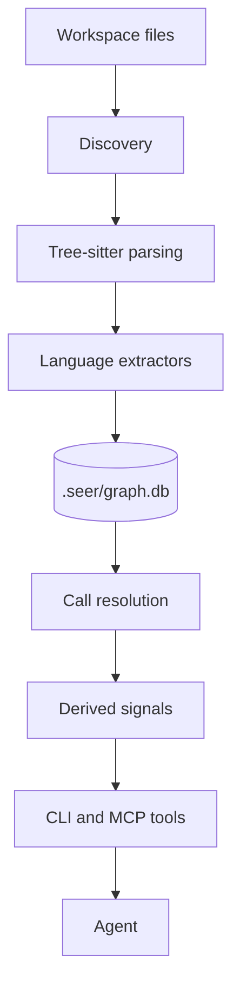
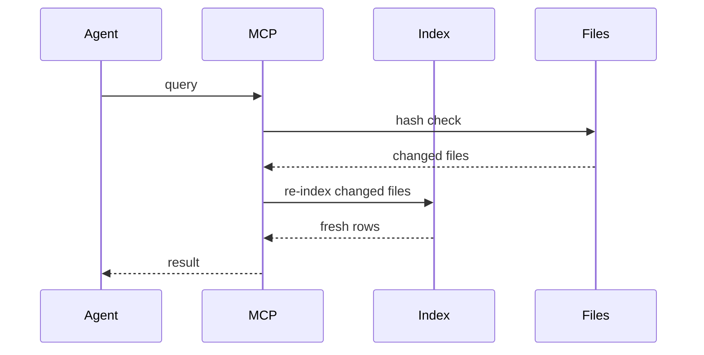

# Architecture

Seer turns a source tree into a local SQLite graph that agents can query in
milliseconds.

## Pipeline

## Stages

| Stage | What happens |
|---|---|
| Discovery | File walking respects `.gitignore` and `.seerignore`, then classifies files. |
| Parsing | Tree-sitter WASM parsers run across worker threads. |
| Extraction | Language extractors emit symbols, calls, imports, routes, config, and hashes. |
| Storage | Rows land in `<repo>/.seer/graph.db`. |
| Resolution | Calls are linked to definitions by scope. |
| Derived signals | Modules, service links, risk, tests, history, and bundles build on the base graph. |

## What Gets Stored

| Table family | Holds |
|---|---|
| Files | Path, hash, language, role. |
| Symbols | Definitions, names, ranges, roles, PageRank. |
| Edges | Calls, imports, and resolved links. |
| Routes | HTTP, RPC, GraphQL, gRPC, queue handlers. |
| Service links | Outbound calls resolved to handlers. |
| Modules | Inferred code clusters. |
| Boundaries | Package and service partitions. |
| Config | Env and config reads. |
| History | Symbol-level git evidence. |
| Bundles | Imported read-only repo layers. |

## Derived Signals

### Modules

Seer builds a weighted file graph and clusters related files. This helps an
agent find the subsystem before reading random files.

### Behavior Tests

`seer_behavior` ranks tests by direct calls, naming, graph distance, assertion
density, and recency.

### Edit Risk

`seer_risk` explains risk with components:

| Component | Signal |
|---|---|
| Fan-in | Many callers depend on the symbol. |
| Route exposure | Public endpoints can reach it. |
| Test coverage | Few tests exercise it. |
| Boundaries | The change crosses packages or services. |
| Complexity and churn | The code is hard or has moved recently. |

## Freshness

Seer keeps a watcher running and also checks file hashes before query results
return. Changed files are parsed before the answer goes back to the agent.

## Product Layers

| Layer | Role |
|---|---|
| Seer-Core | Local deterministic engine in this repo. |
| Seer-Onboarding | Human-facing layer that can sit on top of Core. |

This repo documents Core.
