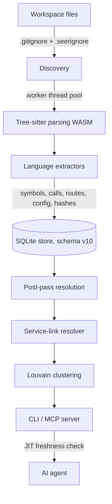

# Architecture

Seer turns a directory of source files into a small SQLite graph that an agent
can query in milliseconds. This page is the high-level tour. For the lower-level
decisions (caching, edge resolution, worker pooling), see
[Implementation Notes](internals.md).

---

## The pipeline

1. **Discovery.** A fast directory walker respects layered `.gitignore` and
   `.seerignore` rules and classifies each file as `project`, `test`,
   `generated`, or `vendor`. Low-value files are dropped before they ever reach
   a parser.
2. **Parsing.** Files are parsed with Tree-sitter compiled to WASM, spread
   across a pool of worker threads so a large repo is not bottlenecked on one V8
   isolate.
3. **Extraction.** Per-language extractors walk the AST and emit symbols
   (with qualified names), call edges, routes, config reads, complexity metrics,
   and structural shape hashes.
4. **Storage.** Everything lands in one SQLite file, `<repo>/.seer/graph.db`,
   under schema version 10. Writes are idempotent and incremental.
5. **Resolution.** A post-pass links each call to the exact symbol it targets,
   using a three-pass scope-aware strategy (same-file, then imported-file, then
   global fallback).
6. **Derived signals.** Service links, Louvain modules, shape hashes, and symbol
   history are computed on top of the base graph (some during indexing, some
   lazily on first query).

---

## What gets stored

| Table | Holds |
|---|---|
| `files` | paths, hashes, language, role classification |
| `symbols` | definitions with short + qualified names, roles, `is_rankable` |
| `edges` | resolved caller/callee and import relationships |
| `routes` | HTTP / tRPC / GraphQL / gRPC / message-queue handlers |
| `service_calls` / `service_links` | outbound calls resolved to routes |
| `modules` / `boundaries` | Louvain clusters and monorepo partitions |
| `config_keys` | env/config reads mapped to their enclosing symbol |
| `external_dependencies` | packages declared in manifests |
| `external_bundles` | read-only layers imported from other repos |
| `symbol_history_continuity` | resolved rename/move lineage |

The full schema and table relationships are in [internals.md](internals.md).

---

## Three derived signals worth knowing

These are where Seer goes beyond "structured grep".

### Louvain modules
Seer builds a weighted file graph (import edges weigh 2, call edges 1, test
edges 3) and runs Louvain community detection. The result is a set of cohesive
modules, so an agent can find the "auth" or "billing" subsystem before scanning
directories.

### Tests as behavioral specs
Rather than a flat list of test files, `seer_behavior` ranks the tests that
exercise a symbol by how directly they hit it: direct calls first, then naming
conventions, then call-graph distance, then assertion density and recency.

### Decomposed edit-risk
`seer_risk` does not hand back a mystery number. It shows the components: caller
fan-in, public route exposure, missing test coverage, monorepo boundary
crossings, and complexity plus churn. The agent can see *why* a change is risky.

---

## Freshness

Correctness is a product requirement. If an agent edits a file, the next query
must reflect it.

- A **Chokidar watcher** keeps the index warm in the background, debouncing
  bursts of writes.
- A **JIT freshness check** runs an instant hash comparison before any query
  returns. Anything that changed is re-parsed serially right then, so results
  are never stale, and concurrent reads are never blocked.

---

## Two product layers

Seer-Core (this repository) is the deterministic, local, zero-AI engine
described above. A separate Seer-Onboarding layer is designed to sit on top and
translate these facts into human-facing visual walkthroughs. Everything in this
repo is Core.
