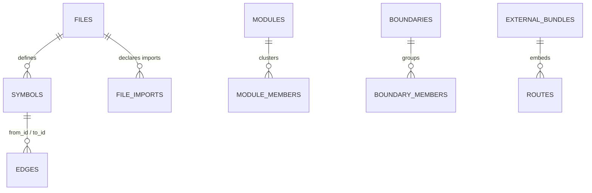

# Implementation Notes

This is the engineering companion to [Architecture](architecture.md). It covers
the decisions that are easy to get wrong and that Seer cares about: the stack,
caching, edge resolution, worker pooling, and the database schema.

---

## Stack

| Piece | Choice | Why |
|---|---|---|
| Runtime | Node.js 18+ (26+ recommended) | Standard worker threads, fast local startup. |
| Language | TypeScript, CommonJS output | Type safety for graph code; CommonJS maps cleanly to Node tooling. |
| Database | built-in `node:sqlite` | Zero native npm dependencies; no compiler traps. |
| Parser | `web-tree-sitter` (WASM) | Tree-sitter parsing in V8 with no native C++ build. |
| Grammars | `tree-sitter-wasms` | Pre-compiled grammars, loaded lazily per language. |

The "zero native dependency" rule is deliberate. The whole thing installs and
runs without a compiler toolchain, which is what makes the `npx` install path
realistic across machines.

---

## Database schema (v10)

One file, `<repo>/.seer/graph.db`, with `CURRENT_SCHEMA_VERSION = 10`.
Migrations are idempotent and run automatically when the database is opened for
writing, using `ALTER TABLE ADD COLUMN` and `CREATE TABLE IF NOT EXISTS` checks,
so an old index upgrades in place.

Symbols carry a `symbol_role` (`definition`, `declaration`, or `type_ref`) and an
`is_rankable` flag. Forward declarations and type references are stored but kept
out of PageRank and hidden from default search, which is what keeps a 3-million-
node C codebase from drowning in noise.

---

## Incremental caching and lazy PageRank

- **Content hashing.** Every file's SHA-256 is recorded. An unchanged file is
  skipped entirely on re-index. When a file does change, foreign keys cascade
  the old rows out cleanly before the new ones go in.
- **Lazy PageRank.** PageRank runs only over rankable symbols, and only when the
  graph actually changed. No new files, edges, or deletions means the previous
  vector is reused. On a large repo this turns a multi-second pass into a no-op.

---

## Scope-aware edge resolution

Linking a call (`to_name`) to a concrete definition (`to_id`) is a three-pass
post-index step. Each pass only fills links still NULL, so the narrowest scope
wins:

1. **Same-file.** The callee is defined in the caller's own file.
2. **Imported-file.** Follow the caller's resolved imports and match there.
3. **Global fallback.** Bind to a global definition of that name, used only when
   scope cannot decide.

---

## Parser worker pooling

`web-tree-sitter` shares a single V8 isolate, which blocks normal Promise
concurrency. So parsing runs in a pool of native worker threads, each with its
own WASM heap and parser context. The main thread keeps all SQLite writes serial
and in input order, which keeps `AUTOINCREMENT` IDs deterministic across runs.
JIT freshness syncs stay serial on purpose, because spinning up workers for a
two-file edit is slower than just doing it.

A query-assisted walker compiles each extractor's declared candidate node types
into a Tree-sitter query once, then only runs extractor callbacks on captured
nodes. Set `SEER_USE_CANDIDATE_QUERY=0` to force the plain walker.

---

## Monorepo boundaries

Boundaries come from package manifests (`package.json`, `go.mod`, `Cargo.toml`)
or fallback paths like `packages/*` and `services/*`. When a call edge starts in
boundary A and resolves into boundary B, that crossing is recorded and surfaced
in the `boundaryCrossings` part of a risk profile.

---

## Rename and move continuity

For per-symbol history that survives refactoring, Seer compares a 64-bit SimHash
over identifier-folded AST subtrees, plus Hamming distance and scope similarity.
Common shapes (think standard getters) with several matches are capped at low
confidence and require a name or scope match, so it does not invent links. This
is snapshot evidence; true cross-commit lineage is delivered by `seer history`
(git follow plus line overlap).
