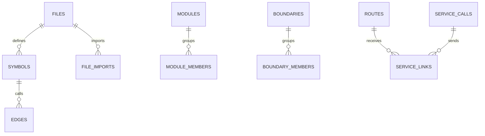
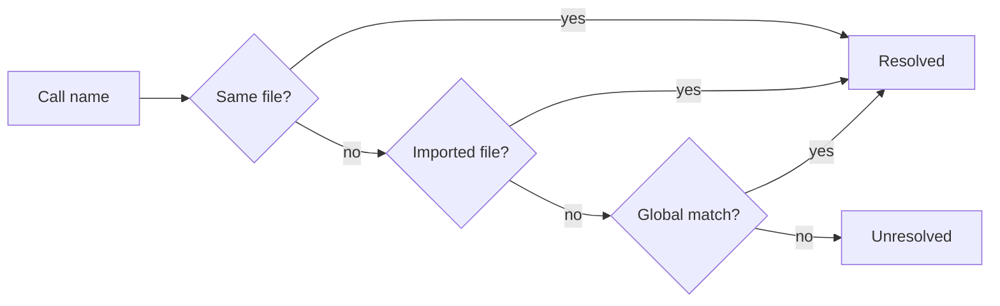

# Implementation Notes

This page is the engineering companion to [Architecture](architecture.md). It is
still public, but it assumes you care about how the engine works.

## Stack

| Piece | Choice | Reason |
|---|---|---|
| Runtime | Node.js 24+ | Built-in SQLite, worker threads, fast startup. |
| Language | TypeScript | Safer graph and schema code. |
| Output | CommonJS | Simple Node and `npx` compatibility. |
| Database | `node:sqlite` | No native npm dependency. |
| Parser | `web-tree-sitter` | Tree-sitter in WASM. |
| Grammars | `tree-sitter-wasms` | Prebuilt grammars loaded by language. |

The install path should work without a compiler toolchain.

## Database

One repo gets one SQLite file:

```text
<repo>/.seer/graph.db
```

Migrations are idempotent and run when the database opens for writing.



Symbols carry a `symbol_role`:

| Role | Meaning |
|---|---|
| `definition` | Real symbol definition. |
| `declaration` | Forward declaration or signature. |
| `type_ref` | Type reference stored for context. |

Only rankable definitions feed PageRank and default search.

## Incremental Caching

| Mechanism | Effect |
|---|---|
| SHA-256 file hashes | Unchanged files are skipped. |
| Cascading deletes | Changed files remove old rows cleanly. |
| Lazy PageRank | PageRank runs only when the graph changed. |
| Serial writes | SQLite row IDs stay deterministic. |

## Edge Resolution

Calls are linked after parsing. Narrow matches win first:



SCIP overlays can add compiler-grade edges on top of the Tree-sitter baseline.

## Worker Pool

Parsing runs in worker threads. Each worker owns its parser context and WASM
heap. The main thread handles database writes in input order.

JIT freshness stays serial because a one-file edit is usually faster to parse
directly than to schedule through the pool.

## Boundaries

Boundaries come from manifests and common workspace paths:

| Source | Examples |
|---|---|
| Package manifests | `package.json`, `go.mod`, `Cargo.toml` |
| Workspace paths | `packages/*`, `services/*`, `apps/*` |

Cross-boundary calls feed risk and architecture views.

## Symbol History

Symbol history uses git plus symbol ranges. It tracks commits that touched a
specific symbol and stores resume watermarks so interrupted builds can continue.

Continuity adds current-tree rename and move evidence with shape hashes and
scope similarity. It is advisory evidence. `seer_history` is the stronger source
for cross-commit lineage.
