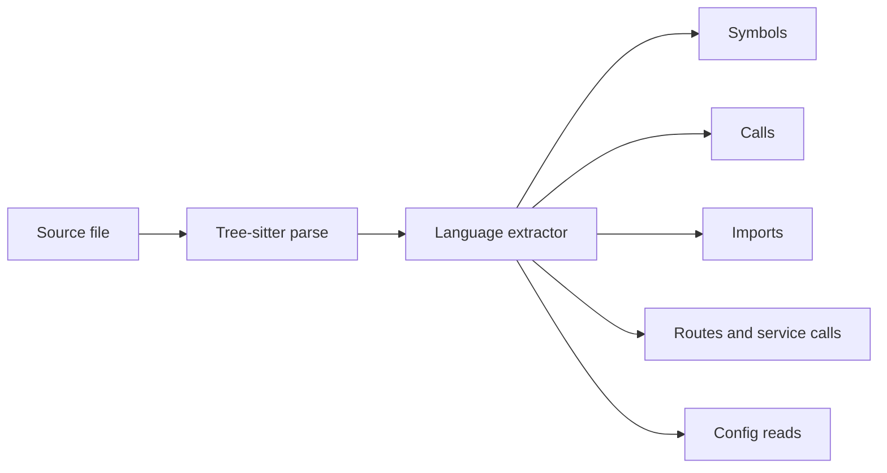

# Language Support

Seer uses Tree-sitter parsers and language-specific extractors. Every supported
language gets the structural core: definitions, qualified names, calls, imports,
complexity, and shape hashes.

## Capability Matrix

| Language | Symbols + calls | Imports | Server routes | Service calls | Config reads |
|---|:---:|:---:|:---:|:---:|:---:|
| Python | yes | yes | FastAPI, Flask | requests, httpx | `os.getenv` |
| JavaScript | yes | yes | Express, Fastify | fetch, axios | `process.env` |
| TypeScript / TSX | yes | yes | Express, Fastify, tRPC, GraphQL | fetch, axios | `process.env` |
| Go | yes | yes | gRPC from `.proto` | gRPC, net/http clients | `os.Getenv` |
| Java | yes | yes | Spring Boot | gRPC, RestTemplate, HttpClient | `System.getenv` |
| Rust | yes | yes | planned | reqwest-style clients | env reads |
| C | yes | yes | planned | planned | planned |
| C++ | yes | yes | planned | planned | planned |
| C# | yes | yes | planned | gRPC, HttpClient | env reads |

**Server routes** means Seer can extract handlers from framework code or `.proto`
files. A language can still appear as a client in service links even when route
extraction for that language is planned.

## Notes By Language

| Language | Detail |
|---|---|
| C / C++ | Body gating avoids phantom symbols from type references. Out-of-line methods rebuild owning scope. |
| TypeScript / TSX | TSX components, template-literal URLs, tRPC, and GraphQL are included. |
| Java | Spring class-level prefixes are applied to method routes. |
| C# | Constructor and member calls are tracked. |
| `.proto` | gRPC services become routes regardless of implementation language. |

## What The Core Extracts

## Adding A Language

Contributor-level detail lives in [Implementation Notes](internals.md). The work
usually looks like this:

| Step | Task |
|---|---|
| 1 | Register file extensions and the Tree-sitter grammar. |
| 2 | Add an extractor in `src/parser/languages/<lang>.ts`. |
| 3 | Emit definitions, calls, references, and imports. |
| 4 | Add optional route, service-call, and config extraction. |
| 5 | Add fixtures and smoke tests. |

Good starting points:

| Target style | Existing extractor to study |
|---|---|
| Procedural C-family | `go.ts` |
| Rich imports and web routes | `typescript.ts` |
| C++ scope edge cases | `cpp.ts` |
