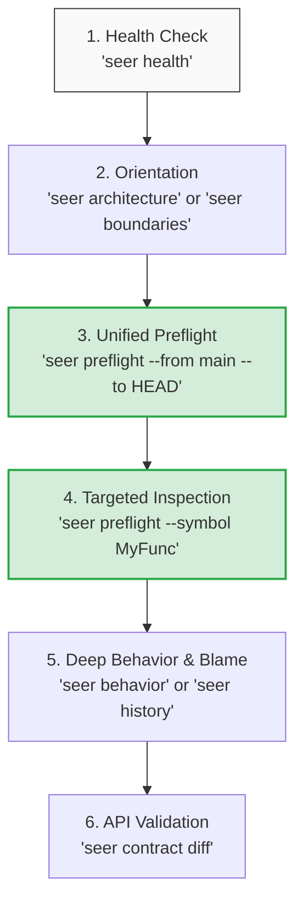

# Seer CLI & MCP Docs For AI Agents

This file is a compact command guide for agents using Seer from a shell or MCP client. Seer-Core is deterministic and non-AI: commands return structural facts, metrics, and relationships from a local SQLite index.

Default database location: `<repo>/.seer/graph.db`.
Most query commands auto-detect `.seer/graph.db` by walking upward from the current directory. Use `--db <path>` when querying a saved DB or a repo from outside its root.

---

## 1. First Call & Reindexing

```bash
seer index <repo-path>
```

Builds or refreshes the index. Run this before query commands unless an MCP server has already created the index.

### Useful Options:
```bash
seer index <repo-path> --db <path>
seer index <repo-path> --reset
seer index <repo-path> --verbose
seer index <repo-path> --max-file-kb 1024
seer index <repo-path> --mode fast
seer index <repo-path> --mode full --include-vendor --include-generated
seer index <repo-path> --parallel
seer index <repo-path> --no-parallel
seer index <repo-path> --jobs 4
```

*   **Discovery Modes (`--mode`):** `standard` (default, excludes massive dependencies/generated files), `fast` (excludes docs/examples/static assets), or `full` (indexes everything).
*   **Worker Parsing:** Enabled automatically for normal/large repos. Tiny repos stay serial unless forced via `--parallel`. Disable worker parsing via `--no-parallel`.

---

## 2. Health, Stats & Architecture

```bash
seer health [--db <path>]
seer stats [--db <path>]
seer architecture [--db <path>]
```

*   **`health`:** Quick check of database status, schema version (now **v10**), and role counts. Cheap; never blocks on freshness.
*   **`stats`:** Numeric counts of files, symbols, edges, routes, and config keys.
*   **`architecture`** (or `arch`): High-level snapshot of the codebase including top symbols, Louvain module sizes, entry points, and API frameworks.

---

## 3. Search & Symbols

```bash
seer symbols [query] [--db <path>] [--file <path>] [--top <n>]
```

*   Without a query, lists top PageRank symbols (rankable kinds only: functions, methods, constructors, classes).
*   With a query, performs a substring search across names and qualified names.

### Filtering Options:
Default queries hide vendor, generated, test-file symbols, forward declarations, and type references. Opt in explicitly:
```bash
seer symbols <query> --include-tests
seer symbols <query> --include-declarations
seer symbols <query> --include-vendor
seer symbols <query> --include-generated
seer symbols <query> --include-type-refs
```

---

## 4. Call Graph (Legacy vs. Id-Scoped)

```bash
# Legacy, name-based (broad, returns all symbols matching short name)
seer callers <symbol> [--db <path>] [--limit <n>]
seer callees <symbol> [--db <path>] [--limit <n>]
```

For high-precision queries, prefer the **Track E/v10 consolidated tools** (`preflight`, `context`, `risk`) which map call graphs to resolved, exact IDs.

---

## 5. Routes, Dependencies, Config

```bash
seer routes [--db <path>] [--method POST] [--framework express] [--path checkout] [--limit <n>]
seer deps [--db <path>] [--ecosystem npm] [--name react] [--limit <n>]
seer config [--db <path>] [--key DATABASE_URL] [--limit <n>]
```

*   **`routes`:** Static API registrations (Express, Fastify, FastAPI, Flask, Spring, gRPC, tRPC, GraphQL, and message brokers).
*   **`deps`:** External dependencies parsed from manifests (`package.json`, `Cargo.toml`, `pyproject.toml`, etc.).
*   **`config`:** Deterministic environment variable or configuration reads mapped back to their enclosing symbol.

---

## 6. Monorepo Boundaries (New in v10)

Detects logical barriers in monorepos based on package manifests (`package.json`, `go.mod`, `Cargo.toml`, etc.) or fallback paths (`packages/*`, `services/*`).

```bash
seer boundaries [--db <path>] [--limit <n>]
```

*Advisory only. Edges crossing logical boundaries are flagged as `boundaryCrossings` in risk profiles.*

---

## 7. Preflight, Context & Risk (Consolidated Workspace Intelligence)

```bash
# Consolidated Context (Symbol mode)
seer preflight --symbol <symbol> [--file <path>]

# Consolidated Context (Range/Change mode)
seer preflight --from <ref> --to <ref> [--old-bundle <path>] [--new-bundle <path>]
```

### Preflight Command Options:
*   `--symbol <name>` / `--file <path>`: Build a pre-edit packet for the specific symbol.
*   `--from <ref>` / `--to <ref>`: Diff-range packet. Translates Git diff line changes into affected AST symbols via `detectChanges` to map downstream blast radius.
*   `--old-bundle <path>` / `--new-bundle <path>`: Optional bundle pair to attach a **Contract Diff** preview automatically.
*   `--max-symbols <n>` / `--max-tests <n>` / `--max-history <n>`: Caps for returned segments.
*   `--json`: Print machine-readable JSON output.

### Legacy/Specific Queries:
```bash
seer context <symbol> [--db <path>] [--file <path>] # Pre-edit evidence bundle (use --file to disambiguate)
seer risk <symbol> [--db <path>] [--depth <n>]       # Decomposed risk scores (cyclomatic, complexity, boundary crossings)
seer behavior <symbol> [--db <path>] [--limit <n>] [--depth <n>] # Ranked tests-as-behavioral-spec exercising the symbol
seer detect-changes [--db <path>] [--from <ref>] [--to <ref>] [--depth <n>] # Stands-alone blast-radius diff
```

---

## 8. Git History, Churn & Continuity (v10 Refinement)

```bash
# File-level git stats
seer churn [--db <path>] [--workspace <path>]

# Build the symbol-history index (opt-in pass)
seer symbol-history [--db <path>] [--workspace <path>] [--max-commits <n>] [--force]

# Query exact symbol-level git blame chain
seer history <symbol> [--db <path>] [--limit <n>]
```

### Rename & Move Continuity (New in v10)
Seer tracks symbol renames and cross-file moves using structural shape-hash comparison, Hamming distance, and scope analysis.
```bash
seer continuity <symbol> [--db <path>]
```
*   Continuity is folded automatically into `seer history` and `seer preflight` to stitch together unbroken, historical blame chains across refactorings.

---

## 9. Portability, Precision & Diffing (v10 Restructure)

```bash
# Export / Import portable bundles
seer bundle export [--workspace <path>] [--db <path>] [--out <path>] [--level <n>] [--built-at <ms>]
seer bundle import <bundle> [--workspace <path>] [--db <path>] [--overwrite] [--skip-integrity-check] [--skip-schema-check]
seer bundle info <bundle>
```

### External Bundle Layers (New in v10)
Imports external contracts (like dependent microservices) additively as read-only virtual "phantom files" so they participate in local service-link resolution.
```bash
seer bundle import billing.seerbundle --external [--alias <name>] [--force]
seer bundle external [--db <path>] # Lists currently active external bundle layers
```
*   Additive and idempotent (skips if hashes match; forced re-imports safely delete the old phantom file).

### Contract Diff (New in v10)
Compares two `.seerbundle` files directly on disk without importing them, identifying API changes across all protocols.
```bash
seer contract diff <old-bundle> <new-bundle> [--json] [--include-callers]
```
*   Use `--include-callers` to enrich the diff with a list of local service-link callers impacted by API contract modifications.

### Continuous Integration:
```bash
seer ci bundle [--workspace <path>] [--out <path>] [--mode <mode>] [--no-reset] [--no-parallel] [--built-at <ms>]
seer ci workflow # Prints a ready-to-paste GitHub Actions YAML workflow
```

### Precision overlays & Duplicates:
```bash
seer scip-import <scip-path> [--workspace <path>] [--db <path>] [--require-file-in-index]
seer duplicates [--db <path>] [--max-distance <n>] [--min-loc <n>] [--include-tests] [--limit <n>]
```

---

## 10. Service Links

Resolves client-side outbound network calls (`fetch`, `axios`, gRPC, tRPC, GraphQL, SQS, RabbitMQ, Redis, etc.) to concrete indexed framework route handlers.

```bash
seer service-calls [--db <path>] [--protocol <p>] [--method <m>] [--framework <f>] [--path <substr>] [--limit <n>]
seer service-links [--db <path>] [--protocol <p>] [--method <m>] [--path <substr>] [--match-kind <k>] [--limit <n>]
seer trace-service <from> <to> [--db <path>] [--depth <n>]
```

---

## 11. MCP Server

```bash
seer mcp --workspace <repo-path> [--db <path>] [--no-watch] [--no-jit]
```

Runs the stdio JSON-RPC MCP server. This is the primary interface for developer agents, supporting **54 high-fidelity tools**:

### Reliability & Optimization Features (New in v10)

To minimize context window bloating, improve resilience against agent spelling mistakes, and optimize network overhead, Seer-Core includes several developer-agent specific optimization features:

*   **Dynamic Token Budgeting (`tokenBudget`):** The 7 high-volume list tools (`seer_symbols`, `seer_definition`, `seer_callers`, `seer_callees`, `seer_service_calls`, `seer_service_links`, and `seer_complexity`) accept an optional `tokenBudget` parameter. If supplied, Seer dynamically packs the pre-sorted items so that the serialized JSON payload remains under the specified token budget (assumed at ~4 characters per token). Truncated payloads carry `truncated: true`, an `omitted` count, and a helpful note, whilst guaranteeing that at least one matching item is returned. If omitted, lists are returned without trimming.
*   **Failsafe "Did-You-Mean" Suggestions:** When query tools (`definition`, `symbols`, `callers`, `risk`, `context`, `behavior`, `symbol_module`, `continuity`) return zero results, they perform a fuzzy FTS query and return up to 5 matching suggestion candidates in a `didYouMean` block. Candidates are never auto-substituted, preserving deterministic query integrity.
*   **Lazy Lifecycle Rebuilds:** Heavy analytical indexes (Louvain modules, SimHash shape hashes, and symbol history) are automatically computed once-per-process on the first dependent query if the index is blank, recovering instantly from blank imported indices.
*   **Batch Execution & Umbrella Tracing:** Allows running up to 25 read-only tools sequentially in-process in a single round-trip using `seer_batch`, and provides a single entry point for all graph traces using `seer_trace`.

### MCP Tool Index:

#### A. Core Navigation & Search
1.  `seer_health`: Watcher status, schema versions, role counts. Cheap (no JIT).
2.  `seer_stats`: Detailed table-by-table database statistics.
3.  `seer_symbols` (`query?`, `top?`, `limit?`, `include*?`): BM25 or PageRank symbol list.
4.  `seer_definition` (`name`, `file?`, `include*?`): Exact definition lookup.
5.  `seer_file_symbols` (`file`, `limit?`): File's symbol list sorted by line.
6.  `seer_callers` (`symbol`, `limit?`): Direct caller preview + true count.
7.  `seer_callees` (`symbol`, `limit?`): Bounded direct callees.
8.  `seer_search` (`query`, `limit?`, `include*?`): Combined BM25 search across files and symbols.
9.  `seer_reindex` (`reset?`): Force an incremental or full index rebuild.

#### B. API Routes & Environment
10. `seer_routes` (`method?`, `framework?`, `pathSubstr?`, `limit?`): Framework routes list.
11. `seer_dependencies` (`ecosystem?`, `nameSubstr?`, `limit?`): External packages list.
12. `seer_config` (`key?`, `source?`, `limit?`): Config/env reads list.

#### C. Complexity & Blast Radius
13. `seer_complexity` (`by?`, `minValue?`, `limit?`, `include*?`): Complexity rankings.
14. `seer_behavior` (`symbol`, `limit?`, `indirectDepth?`, `include*?`): Behavioral test spec list.
15. `seer_trace_path` (`from`, `to`, `maxDepth?`): Bounded BFS call path.
16. `seer_trace_callers` (`symbol`, `maxDepth?`, `maxNodes?`, `limit?`): Transitive callers.
17. `seer_trace_callees` (`symbol`, `maxDepth?`, `maxNodes?`, `limit?`): Transitive callees.
18. `seer_architecture`: One-page architecture snapshot.
19. `seer_detect_changes` (`fromRef?`, `toRef?`, `callerDepth?`): Blast radius for diffs.

#### D. Louvain Modules
20. `seer_modules` (`limit?`, `sortBy?`): Lists Louvain module clusters.
21. `seer_module_members` (`id?`, `label?`, `fileLimit?`, `symbolLimit?`): Files/top symbols.
22. `seer_symbol_module` (`symbol`, `file?`): Resolves the module housing a symbol.
23. `seer_module_dependencies` (`id?`, `label?`, `direction?`, `limit?`): Module edges.
24. `seer_trace_file_dependencies` (`file`, `maxDepth?`, `maxNodes?`): Transitive imports.
25. `seer_trace_module_dependencies` (`id?`, `label?`, `maxDepth?`, `direction?`): BFS module edges.
26. `seer_modules_build`: (Advanced — usually unnecessary.) Rebuild Louvain module clusters.

#### E. Monorepo Boundaries (v10)
27. `seer_boundaries` (`limit?`): Lists detected package boundaries.
28. `seer_boundary_for_file` (`file`): Identifies the boundary containing a file.
29. `seer_boundary_dependencies` (`boundaryId`, `direction?`, `limit?`): Inter-boundary dependency edges.

#### F. Git History & Continuity (v10)
30. `seer_churn`: Triggers file-level git churn collection.
31. `seer_history` (`symbol`, `limit?`, `since?`, `file?`): Overlapping commits.
32. `seer_symbol_history_build` (`maxCommitsPerFile?`, `force?`): (Advanced — usually unnecessary.) Rebuilds symbol history database.
33. `seer_continuity` (`symbol`, `file?`): Rename/move continuity candidates.

#### G. Portability & Precision (v10)
34. `seer_bundle_export` (`out?`, `compressionLevel?`, `builtAt?`): Exports portable `.seerbundle`.
35. `seer_bundle_info` (`bundle`): Reads manifest headers.
36. `seer_bundle_import` (`bundle`, `overwrite?`, `skip*?`, `external?`, `alias?`, `force?`): Destructive or additive peer import.
37. `seer_external_bundles` (`includeRoutes?`, `routesPreviewLimit?`): Lists peer-repo layers.
38. `seer_contract_diff` (`oldBundle`, `newBundle`, `includeAffectedCallers?`): Advisory API diff.
39. `seer_scip_import` (`scipPath`, `requireFileInIndex?`): Adds SCIP precise overlay.
40. `seer_scip_imports`: Lists imported SCIP layers.
41. `seer_provenance`: Breakdown of symbols/edges by precision source.
42. `seer_duplicates` (`maxDistance?`, `minLoc?`, `includeTests?`, `limit?`): Near-duplicate clusters.
43. `seer_shape_hash_build` (`force?`, `minLoc?`): (Advanced — usually unnecessary.) Force SimHash recalculation.

#### H. Service Rendezvous (Track G + H)
44. `seer_service_calls` (`protocol?`, `method?`, `framework?`, `pathSubstr?`, `callerSymbolId?`, `minConfidence?`, `limit?`, `offset?`, `summaryOnly?`): Client calls.
45. `seer_service_links` (`protocol?`, `method?`, `pathSubstr?`, `callerSymbolId?`, `handlerSymbolId?`, `matchKind?`, `minConfidence?`, `limit?`, `offset?`, `summaryOnly?`): Resolved edges.
46. `seer_trace_service_path` (`from`, `to`, `maxDepth?`): Bounded BFS cross-service hops.
47. `seer_trace_service_dependencies` (`from`, `maxDepth?`, `maxNodes?`, `maxFanout?`): BFS cross-service tree.
48. `seer_trace_module_service_dependencies` (`moduleId`, `maxDepth?`, `maxNodes?`): BFS cross-module hops.

#### I. Unified Context
49. `seer_preflight` (`symbol?`, `file?`, `fromRef?`, `toRef?`, `oldBundle?`, `newBundle?`, `maxSymbols?`, `maxTests?`, `maxHistory?`, `callerDepth?`): Consolidated pre-edit range or symbol context.
50. `seer_context` (`symbol`, `file?`, `callerLimit?`, `calleeLimit?`, `testLimit?`, `historyLimit?`, `callerDepth?`, `affectedLimit?`): Consolidated symbol context.
51. `seer_risk` (`symbol`, `callerDepth?`): Decomposed deterministic risk analysis.

#### J. Agent Optimization Tools
52. `seer_skeleton` (`file`, `focusSymbol?`): Render structural file skeleton, signature kept, bodies collapsed deterministic.
53. `seer_trace` (`scope`, `args?`): Umbrella dispatcher over all `seer_trace_*` tools (callers, callees, path, file, module, service, service_path, module_service).
54. `seer_batch` (`calls`): Run up to 25 read-only tools sequentially in a single MCP request.

---

## 12. Recommended Agent Workflow

Maximize efficiency and preserve token budget by starting broad and narrowing focus:



1.  **Check Environment Health:** Run `seer health` to ensure database and watcher states are fresh.
2.  **Orient Structurally:** Check `seer boundaries` or `seer modules` to understand the codebase's high-level logical domains.
3.  **Inspect Affected Areas:** Run `seer preflight --from main --to HEAD` on your working branch. Translate line diffs to affected symbols and see their blast radius.
4.  **Drill Down Before Editing:** Call `seer preflight --symbol <Target>` to pull definitions, callers, tests, risk profile, and history for your target symbol in **one compact call**.
5.  **Examine History & Continuity:** If a symbol was recently refactored, call `seer continuity <symbol>` or check `seer history <symbol>` to view its true lineage.
6.  **Verify API Contracts:** Before compiling, run `seer contract diff` on dependent bundles to ensure no breaking downstream service links were introduced.
7.  **Fallback to Grep:** Use standard text grep only for comments, raw strings, configuration values, or unsupported language details. Use Seer for all structural navigation.
